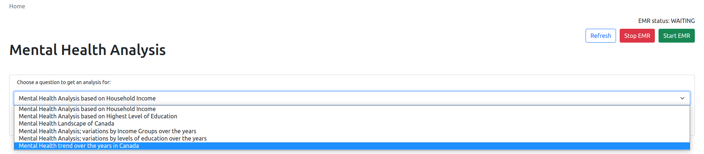

# mental-health-analysis



## Setup:

1. Install all the requirements from [requirements](requirements.txt) file. Run the
   command ```pip install -R requirements.txt```.
2. Start the web application using ```python3 server.py```.
3. Make sure to set aws config on the local system. The EMR will be created on this account.

## Using the application:

1. Start an EMR cluster using the "Start EMR" button on the home page.
2. Click "Refresh" to check on the status of this EMR.
3. Once the EMR is created it will go into a "WAITING" state, you can now choose any question to get the analysis for.
4. Once the scripts have been executed on the EMR, the "Get Results" button will appear.
5. Now you will obtain a visualization for the selected question.

## About:

- Different Mental Health Analysis types available:
    - Heatmaps based on Income/ Level of education.
    - Barplots for trends over the years.
    - Geoplot of Canada to show overall mental health in provinces.
- Every step of the process is automated:
    1. Setting up a job to run on the EMR depending on the question.
    2. Saving results to a S3 bucket.
    3. Querying these results from S3.
    4. Generating visualizations based on these results.
- Screenshots [here](res/markdown/results.md).