# Screenshots of the application:

1. Homepage: 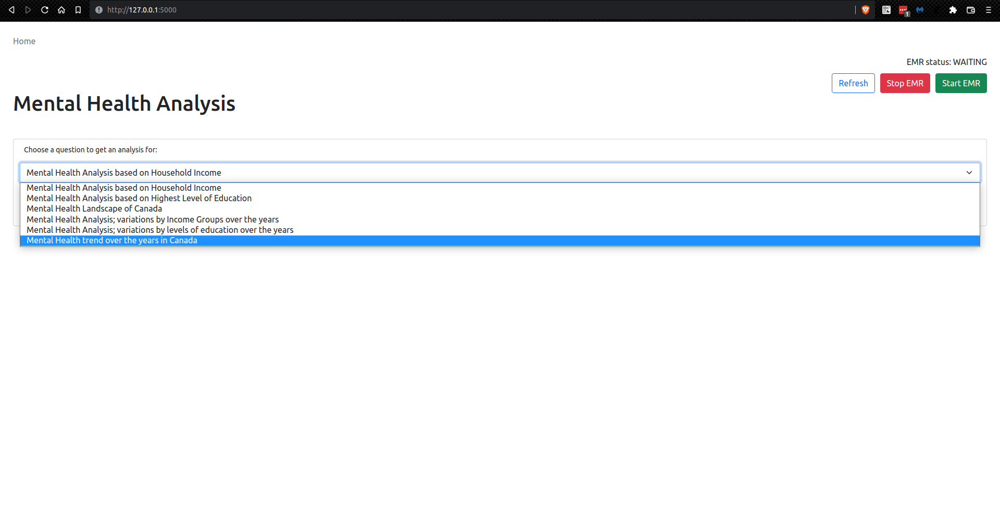
2. Generating Results page: 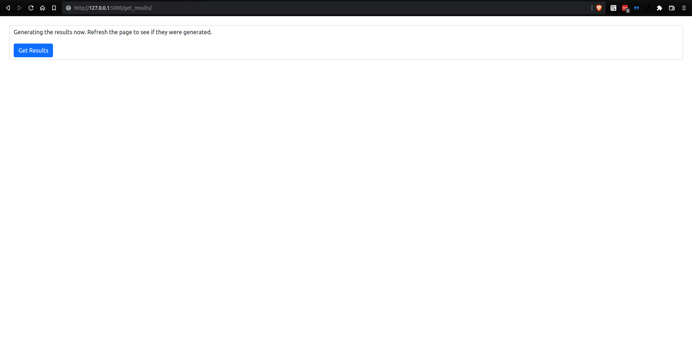
3. Heatmap of Mental Health Score based on Income groups: 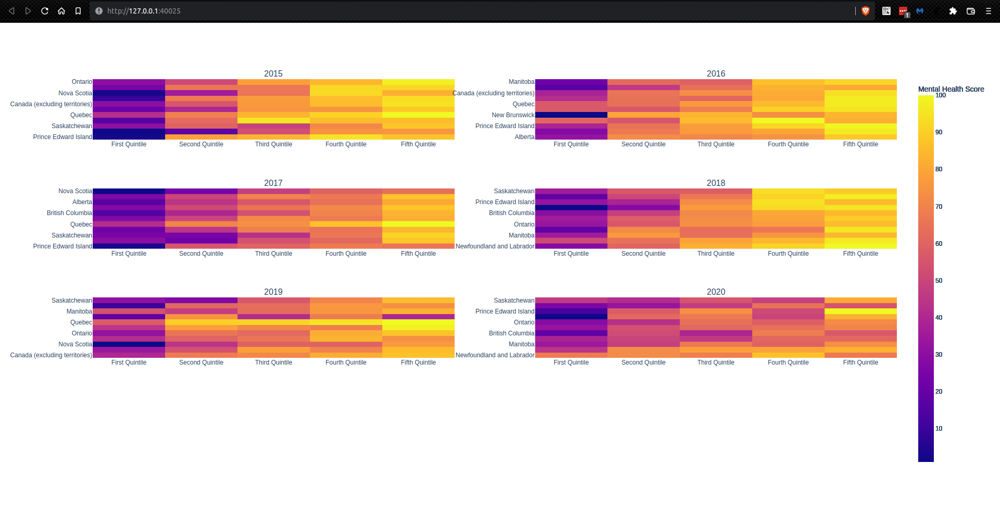
4. Heatmap of Mental Health Score based on Education Level groups: 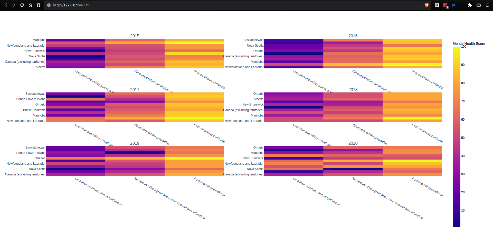
5. Geomap of Mental Health Scores across Canada: 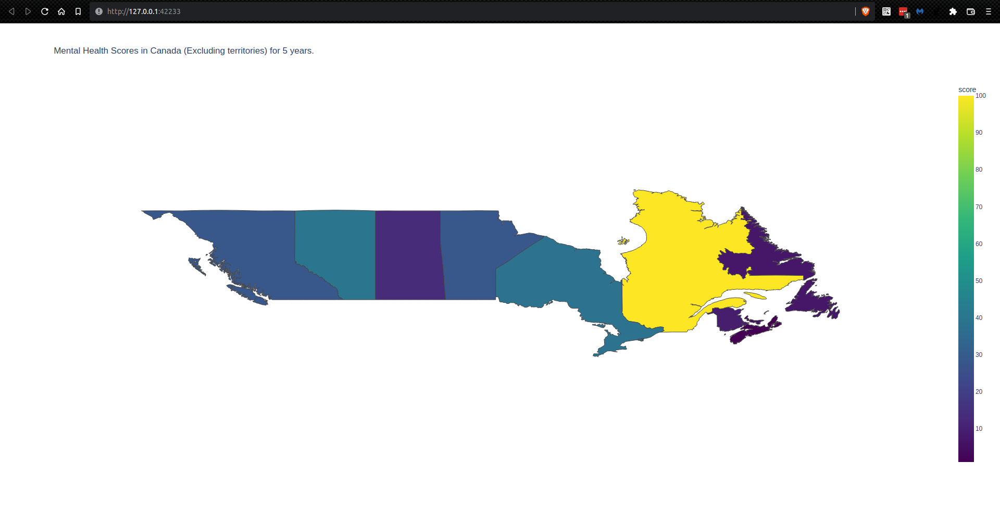
6. Analysis of Mental Health over the years based on Income
   groups: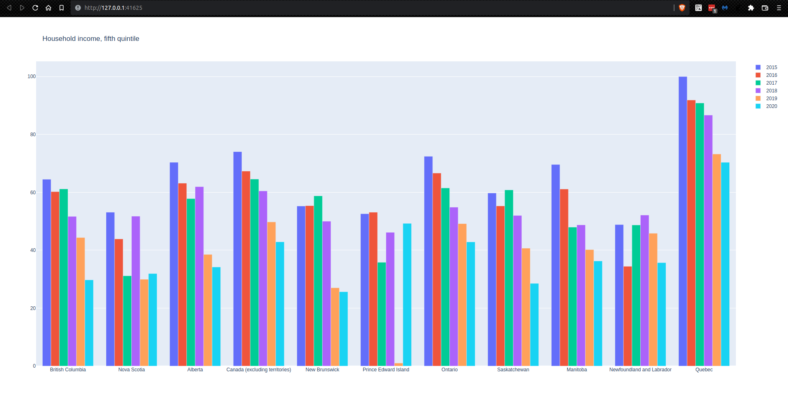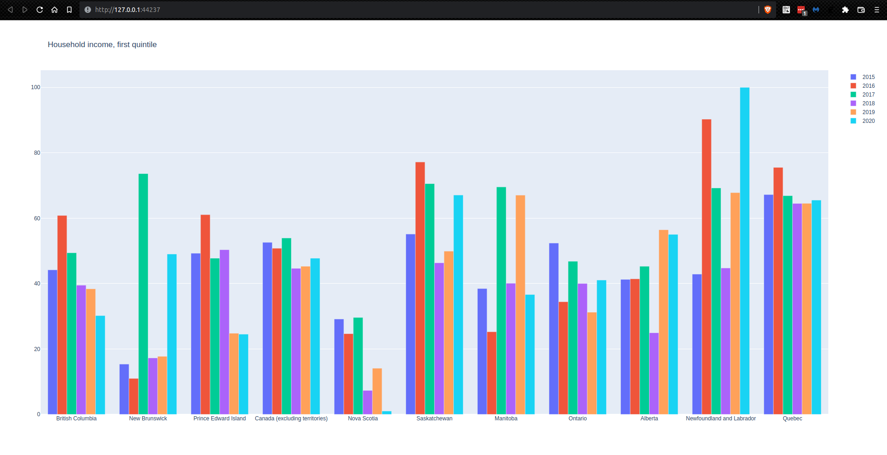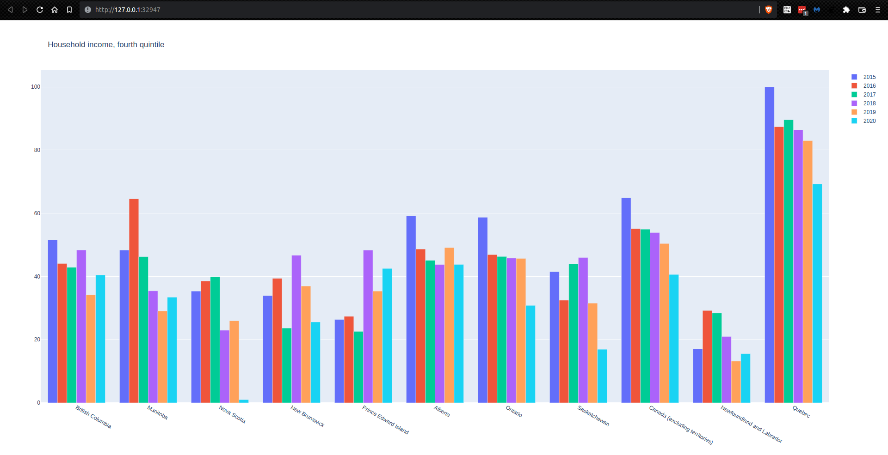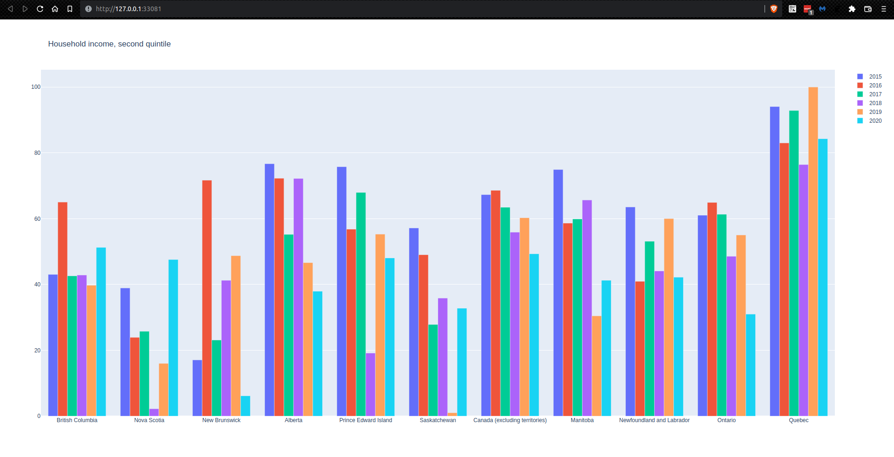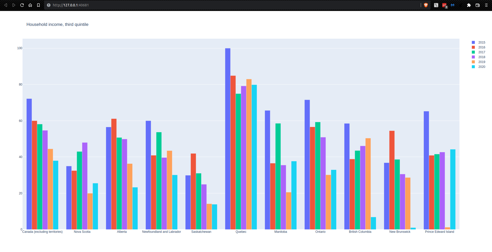
7. Analysis of Mental Health over the years based on Education Level
   groups: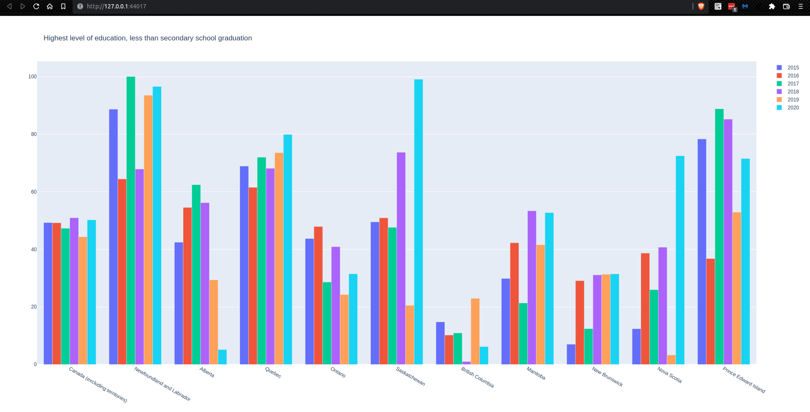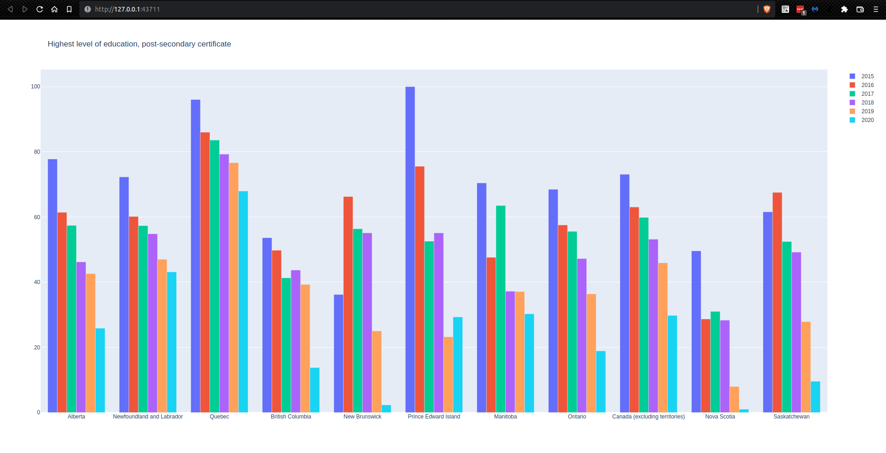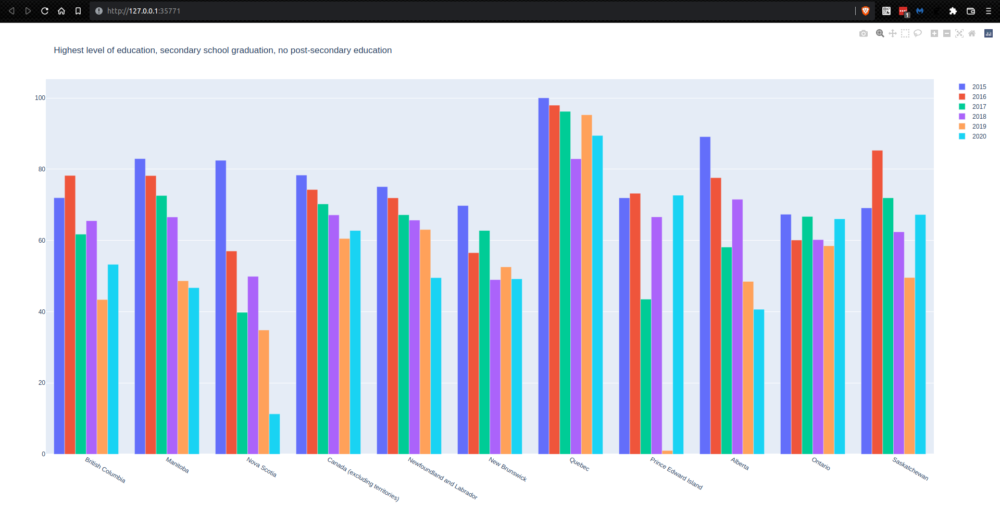
8. Analysis of the Overall Mental Health over the years: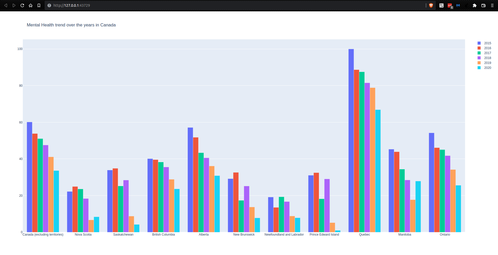